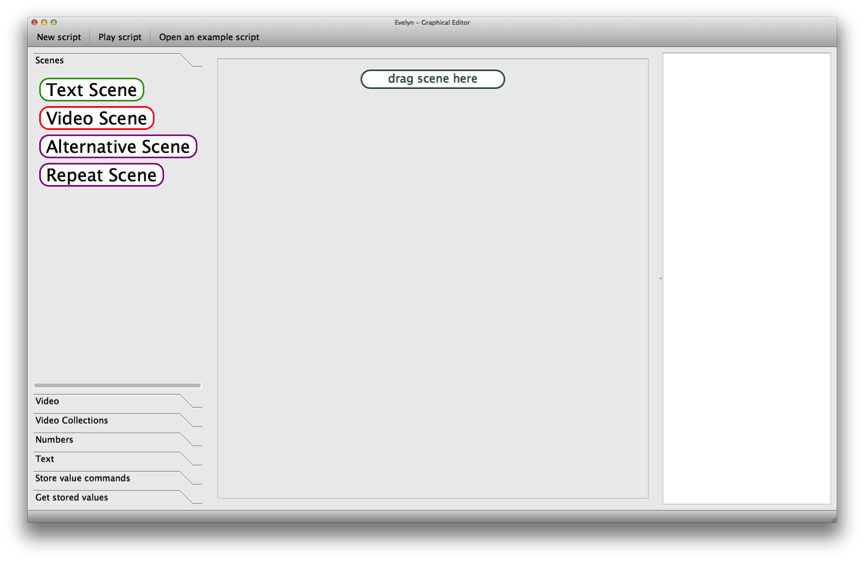
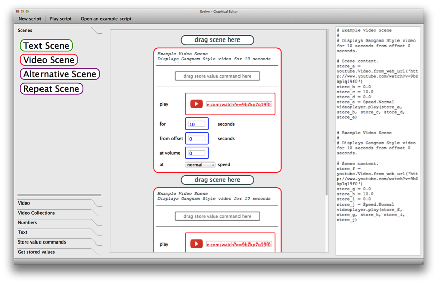
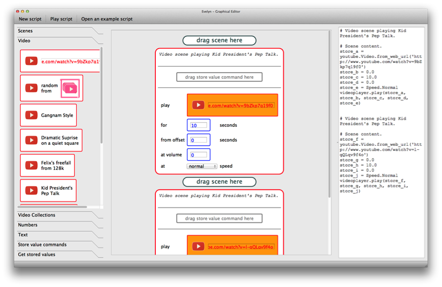
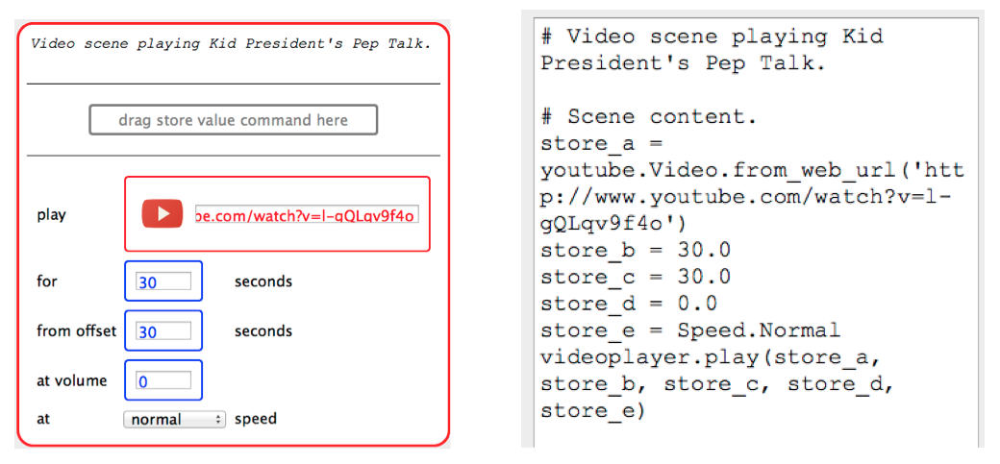

Video Processing Language for the Raspberry Pi
==============================================

[Read more about the visual programming language and development environment](https://github.com/CalumJEadie/video-processing-language-for-the-raspberry-pi/tree/master/app)

[Read more about the dissertation](https://github.com/CalumJEadie/video-processing-language-for-the-raspberry-pi/tree/master/dissertation)

My final year project for my CS undergrad at Cambridge. The project spanned
seven months and was assessed by a written dissertation.

I used the video processing power of the Raspberry Pi to create an educational
visual video processing language for children to explore video processing
and computational thinking on the Raspberry Pi.

## Contents

`/app` - a visual programming language and development environment

`/dissertation` - a written dissertation

## Walkthrough

Alice is a 13-year-old child. She regularly watches videos on YouTube and has acted in her school’s production of Twelfth Night. She is currently studying the script of A Midsummer Night’s Dream in her English classes. Like most children her age, although she is taught ICT at school, she has not been exposed to programming or Computer Science.

Alice is asked to reorder a video by playing the second half before the first half. She starts with an empty script.

Alice has been told that creating a computer program using the editor is similar to creating a film script. She remembers from her acting and English classes that films and plays are divided into scenes that follow one after another. She wonders how she will use the editor to create the video that she has been invited to create.

Alice is not sure what her script will do, so she clicks play script and views two ten second clips from a popular music video, played one after the other. She realises the video corresponding to a YouTube URL is being played, and drags a different video value from the palette into the video slot of the video scenes. As she drags the “Kid President’s Pep Talk” video value across, the video slots in the video scenes highlight to indicate matching types. She also adjusts the number values in the video scenes to play the second half of a video before its first half.

Alice notices there is a correspondence between the script content she has been manipulating and some text next to it, which appears strange to her. Alice is told she has been manipulating a visual representation of her script and that the strange text is a textual representation in a programming language called Python.

## Todo

- Source code for language and editor
- Screenshots
- Installation
- Usage
- Licensing
- Key outcomes of research
- Better quality screenshots
